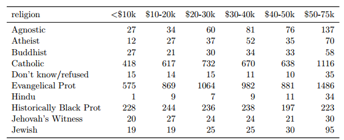
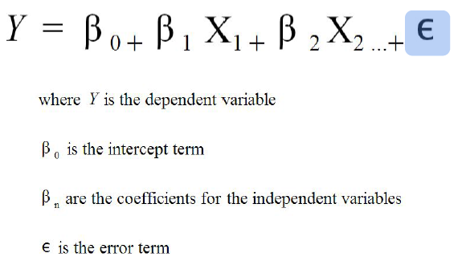
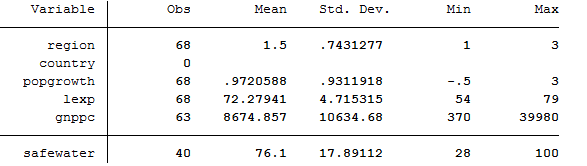
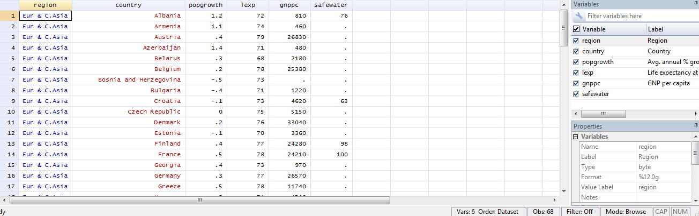
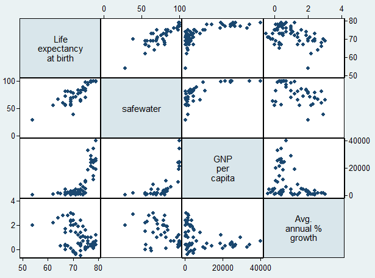
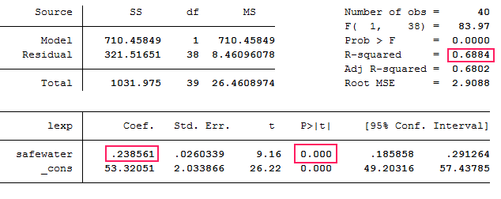
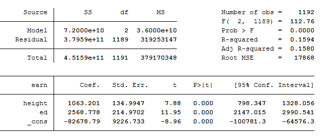
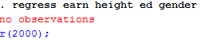
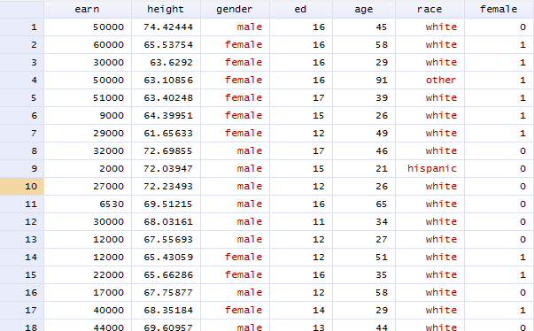

<style>
.title-slide {
  background-color: #c7d8ed
}
</style>

---bg:#ffffff
## Goals for the Hour

- (brief) Introduction to the Stata Interface
- 2 Examples of Linear Regression
- Exporting Regression Tables 
- Where to get help


--- 

## Preliminaries

- tinyurl.com/tischstata

- Open Stata:  Windows -> Data & Statistical Applications -> Stata 14

- In Stata: File -> Change Working Directory... 

--- 
## The Stata Interface

- Command Line
- Review
- Output/Results
- Variables
- Properties

--- 
## Stata Workflow
Highly recommended to keep a do/log file of your sessions

- do file = a script of your syntax that can be executed
- log file = record of your output


---

## Tidy Data = Happy Data 


---

## Tidy Data = Happy Data 
How Many Variables?



---

## Tidy Data = Happy Data 
How Many Variables?


---

## Tidy Data = Happy Data 


---

## Linear Regression




---

## Linear Regression 

<iframe src="https://gallery.shinyapps.io/simple_regression/"></iframe> 


--- 

## Life Expectancy Dataset
Six Variables: region, country, popgrowth, lexp, gnppc, safewater

```
/* this is a comment, does not run */
use lifeexp.dta

```

---

## Life Expectancy Dataset

```
/* basic information about data types */
describe
```


---

## Life Expectancy Dataset

```
/* basic descriptive statistics about our dataset */
summarize
```


---

## Life Expectancy Dataset

```
browse
```
Why are values different colors?




--- 

## Life Expectancy Dataset
Matrix plots 
```
graph matrix lexp safewater gnppc popgrowth
```



---

## Life Expectancy Dataset
regress y x

```
regress lexp safewater
```


--- 

## Life Expectancy Dataset
regress y x


```
regress lexp safewater
```


--- 

## Life Expectancy Dataset
regress y x


```
regress lexp safewater
```


- Each 1 unit increase in safewater estimates a .238 change in life expectancy

--- 


## Life Expectancy Dataset
scatter plot with fit line

```
twoway scatter lexp safewater || lfit lexp safewater
```


---


## Heights Dataset

```
clear
use heights.dta
summarize
```


---


## Heights Dataset
six variables: earn, height, gender, ed, age, race

Is there a significant relationship between height and salary?

```
regress earn height
```
Interpret the output on your own or with a neighbor

---

## Heights Dataset
Is there a significant relationship between height and salary?

```
regress earn height
```


>- - each 1 unit increase in height estimates a 1,222 increase in earnings


---

## Heights Dataset
Multiple Regression 
```
regress earn height ed
```


what happens to our coefficients when we add variables to the model?


---

## Heights Dataset
Multiple Regression with a Categorical Variable

```
regress earn height ed gender
```
>- 


---

## Heights Dataset
Multiple Regression with a Categorical Variable
```
/*one way to create a dummy variable*/
gen female = (gender == "female")

/*and another*/
gen female = 0
replace female = 1 if gender == "female"

/*yet another*/
xi: regress earn i.gender

```


---

## Heights Dataset
Multiple Regression with a Categorical Variable

```
regress earn height ed female
```


---

## Exporting Results
outreg2

```
outreg2 using model.doc
regress earn height 


```


---

## Exporting Results
outreg2

```
regress earn height ed age
outreg2 using model.doc, append


```


---

## Next Steps

- Regression Diagnostics
- Hierarchical Models (ANOVA)
- Non-Linear or Non-parametric Models

---

## Getting Help

- In Stata

```
help regress
```

- Learning Resources
  - http://researchguides.library.tufts.edu/data/stata

---

## thank you!

email: joshua.quan@tufts.edu
---


